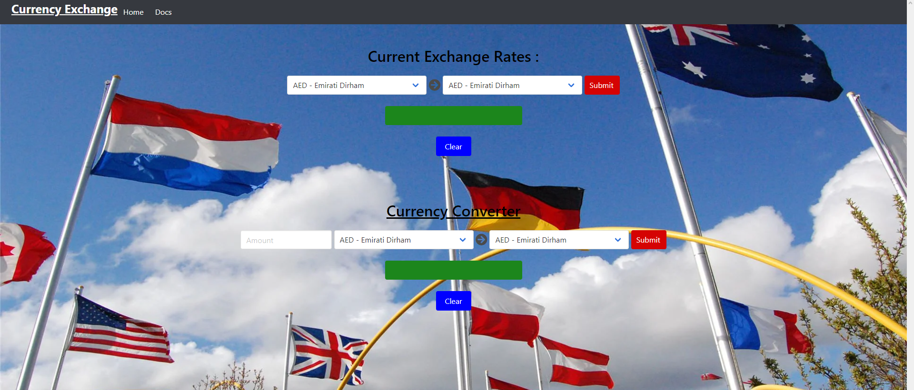

# Currency-Exchange

## Description
Our motivation behind this project is to get an **A** in our coding bootcamp. We built this project to address the financial needs of users seeking to exchange their currency to any other desired currency and point them to their nearest exchange center. Over the course of this project we learned how to collaborate, make better use GitHub, and Git Bash. Currency-Exchange is distinguished by it's scalability.
## Usage
*   Converts selected currency to desired currency in the preferred amount.
*   Displays locations nearby to exchange currency.
### Demo-Image

### Website URL
[Currency-Exchange](WEBSITE LINK INSERT HERE)
## Credits / Reference Material
| TEAM  | Project                                                                                                                                | Author                                                  |
| ----- | -------------------------------------------------------------------------------------------------------------------------------------- | ------------------------------------------------------- |
| 1     | [INSERT PROJECTS](EXAMPLE:https://github.com/larymak/Python-project-Scripts/tree/main/ART%20SCRIPTS/image-ascii)                                     | [Cindy Chynoweth](https://github.com/Cinderbeast)                  |
| 2     | [INSERT PROJECTS]()                                               | [Logan Schoerner]()              |
| 3     | [INSERT PROJECTS]()                                             | [Thomas Holmes](https://github.com/ThomasHolmes00)                  |
| 4     | [INSERT PROJECTS]()                                                       | [Kyle Larsen](https://github.com/kylelarsenlarsen)
1.  https://wallpapercave.com/wp/wp7860706.jpg
2.  https://bulma.io
3.  https://fontawesome.com
4.  https://www.freecodecamp.org/news/how-to-write-a-good-readme-file/
5.  https://developer.mapquest.com/documentation/search-api/v2/radius-search/get/
6.  https://apilayer.com/marketplace/exchangerates_data-api
7.  https://choosealicense.com
## License
MIT License

Copyright (c) [2022] [Kyle Larsen, Thomas Holmes, Logan Schoerner, Cindy Chynoweth]

Permission is hereby granted, free of charge, to any person obtaining a copy
of this software and associated documentation files (the "Software"), to deal
in the Software without restriction, including without limitation the rights
to use, copy, modify, merge, publish, distribute, sublicense, and/or sell
copies of the Software, and to permit persons to whom the Software is
furnished to do so, subject to the following conditions:

The above copyright notice and this permission notice shall be included in all
copies or substantial portions of the Software.

THE SOFTWARE IS PROVIDED "AS IS", WITHOUT WARRANTY OF ANY KIND, EXPRESS OR
IMPLIED, INCLUDING BUT NOT LIMITED TO THE WARRANTIES OF MERCHANTABILITY,
FITNESS FOR A PARTICULAR PURPOSE AND NONINFRINGEMENT. IN NO EVENT SHALL THE
AUTHORS OR COPYRIGHT HOLDERS BE LIABLE FOR ANY CLAIM, DAMAGES OR OTHER
LIABILITY, WHETHER IN AN ACTION OF CONTRACT, TORT OR OTHERWISE, ARISING FROM,
OUT OF OR IN CONNECTION WITH THE SOFTWARE OR THE USE OR OTHER DEALINGS IN THE
SOFTWARE.